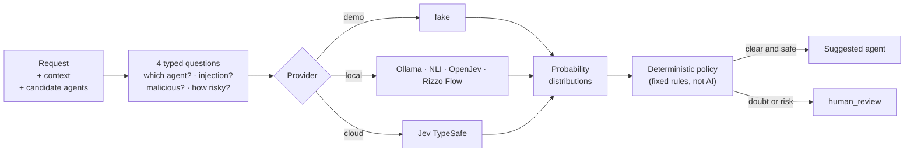

# Decision Router

[Italiano](README.md) · [English](README.en.md)

[](https://github.com/zalaso/decision-router/actions/workflows/test.yml)


**Decides which AI agent or model should handle a request, and whether it is safe to.**

You have several agents (one writes code, one does research, one drives a
browser…) and perhaps several subscriptions or models (Claude, ChatGPT,
Gemini, local models with Ollama). For each request, Decision Router suggests
the best **agent** or **model** among those you have and, in parallel, checks
for prompt injection, malicious intent and risk level. When something is
unclear it does not guess: it asks for **human review**.

The router **only suggests**: it never runs agents, touches files or grants
permissions.

<picture>
  <source media="(prefers-color-scheme: dark)" srcset="docs/img/dashboard-dark.png">
  
</picture>

## Contents

- [Quick start](#quick-start)
- [How it works](#how-it-works)
- [The dashboard](#the-dashboard)
- [Choosing a model](#choosing-a-model)
- [Using it from code: HTTP, CLI, Python](#using-it-from-code)
- [Using a real model](#using-a-real-model)
- [Configuration](#configuration)
- [Security and limitations](#security-and-limitations)
- [Development](#development)

## Quick start

You need **Python 3.12 or newer** ([download](https://www.python.org/downloads/)).
The first run uses **demo mode**: no model to download, no cloud account, no
data leaving your computer.

### Option A: double-click (recommended to try it)

1. On GitHub, click **Code → Download ZIP** and extract the folder
   (or `git clone https://github.com/zalaso/decision-router.git`).
2. Start it:
   - **Windows**: double-click `start.bat`
   - **macOS / Linux**: run `./start.sh` in a terminal

On first run the script creates a `.venv` environment and installs the
dependencies (about a minute), then opens the dashboard at
<http://127.0.0.1:8000/dashboard/>. Later runs start instantly. To stop it,
press `Ctrl+C` in the terminal window.

### Option B: install as a command, straight from GitHub

With [pipx](https://pipx.pypa.io/) or [uv](https://docs.astral.sh/uv/), without
downloading the code by hand:

```bash
pipx install git+https://github.com/zalaso/decision-router.git
```

```bash
decision-router serve --open
```

With uv: `uv tool install git+https://github.com/zalaso/decision-router.git`.
To update: `pipx upgrade decision-router` (or `uv tool upgrade decision-router`).

### Option C: for development

```powershell
git clone https://github.com/zalaso/decision-router.git
cd decision-router
py -3.12 -m venv .venv
.venv\Scripts\python -m pip install -e ".[dev]"
.venv\Scripts\decision-router serve --open
```

On Linux/macOS, use `python3.12 -m venv .venv` and `.venv/bin/` instead of
`.venv\Scripts\`. `uv.lock` is included: `uv sync --locked --extra dev`
installs the pinned versions.

## How it works



1. **Request.** A text arrives, with optional context and the list of agents
   to choose from (each with a natural-language description).
2. **Typed questions.** The router turns the request into four questions: a
   *choice* (which agent?), two *yes/no* (is it prompt injection? is it
   malicious?) and a *score* (low, medium or high risk).
3. **Provider.** A classifier answers with a probability distribution for
   each question. The provider is interchangeable: demo, local model or cloud.
4. **Deterministic policy.** Fixed rules, not AI, decide the outcome. If
   confidence is low, a safety check crosses its threshold or an answer is
   missing, the outcome is `human_review`. An error or timeout is never
   treated as "safe".

Responses always contain `granted_capabilities: []`: a prediction never
becomes a permission. Whoever integrates the router decides what to run.

### Modes

| Mode | What it does |
|---|---|
| `local` (default) | Uses the local backend only. No data leaves the computer. |
| `cloud` | Uses only TypeSafe's Jev cloud API (requires `TYPESAFE_API_KEY`). |
| `auto` | Tries locally. Confidence between 0.55 and 0.80, an error or a timeout: falls back to the cloud. Below 0.55: human review. |
| `shadow` | Queries local and cloud in parallel: uses the primary, records whether the secondary agrees. For comparing models. |

### Local backends

| Backend | Description | Weights |
|---|---|---|
| `fake` (default) | Deterministic keyword demo. **Not a classifier**: synthetic probabilities. | none |
| `nli` | Multilingual mDeBERTa NLI, CPU, offline. Small English variant in `config/local-small.yaml`. | ~558 MB / ~26 MB |
| `openjev` | Optional GPT-AGI/OpenJev adapter with Qwen2.5-0.5B-Instruct. | ~1 GB |
| `rizzo_flow` | Local [Rizzo Flow](https://github.com/Rizzo-AI-Academy/rizzo-flow) service, Jev-compatible HTTP format. | managed by Rizzo |
| `ollama` | One of your local LLMs via [Ollama](https://ollama.com) (for example Qwen 2.5) as classifier, with probabilities from its tokens. **Recommended for choosing a model.** | ~2 GB (3B) |

## The dashboard

Open it with `decision-router serve --open` (or the start scripts) at
<http://127.0.0.1:8000/dashboard/>. It is served by the API itself, with no
build step, no CDN and no extra dependencies: it works offline too.

- **Choose a model**: the recommended model among those you have, plus
  alternatives (see [below](#choosing-a-model)).
- **Route**: type a request (or try the examples, including a prompt
  injection and a malicious request) and see the suggested agent, the
  probability for each agent and the three safety checks against their
  thresholds. Candidate agents can be edited right on the page.
- **Custom decision**: build your own questions (choice, yes/no, score)
  about a text and get the probability distributions, without the router policy.
- **How it works**: an explanation of the flow, modes and backends.
- **Configuration**: the mode, backend and thresholds the server was started
  with. Keys are never shown, only whether they are present. Configuration
  cannot be changed from the browser, on purpose.

Every result has **Copy JSON**, **Copy as curl** and **Copy as PowerShell**
buttons, so you can move straight from trying to integrating. History stays
in the browser tab only. Italian and English UI, automatic light and dark theme.

A link such as `http://127.0.0.1:8000/dashboard/?prompt=Write%20Python%20code`
opens the dashboard and routes that request immediately.

Append `#models` to the link (`...?prompt=...#models`) to send the request to
the "Choose a model" tab instead.

To expose only the API without the UI: `ROUTER_DASHBOARD=false`.

## Choosing a model

<picture>
  <source media="(prefers-color-scheme: dark)" srcset="docs/img/models-dark.png">
  
</picture>

Describe what you need to do and the router tells you **which model to use
among those you have**: one recommended model and, below it, the alternatives.

> **It needs a real classifier.** With the demo backend (`fake`) the result is
> only illustrative: it matches English keywords and always assumes low
> complexity, so for "build a game similar to Call of Duty" it would suggest a
> cheap model. For real advice, in any language, start with a local LLM:
> `start.bat --config config\ollama.yaml` (see
> [Your own LLM with Ollama](#your-own-llm-with-ollama)).

| Choice | How it is decided |
|---|---|
| **Recommended** | By your priority: *Balance* (default), *Savings*, *Speed* or *Quality* |
| Cheapest that is good enough | The lowest cost among the models that reach the required level |
| Fastest that is good enough | The fastest among the models that reach the required level |
| Best available | The most capable model you have for the task, regardless of cost |
| Best local option | The best Ollama model: free and private |

*Balance* picks the cheapest model that clears the required level with a
safety margin.

**How it works.** The classifier does not guess the model: it only works out
what kind of task it is (code, reasoning, writing, research, conversation,
images) and how complex it is (low, medium, high). Fixed rules then match
those answers against a model catalog and choose among the models you selected:

- every model has a 0-10 score per task type, a relative cost and a speed;
- complexity sets the minimum level: 4/10, 6/10 or 8/10;
- if the request is ambiguous between two tasks, the model must be good at
  both; if complexity is uncertain, it is treated as one level higher. When in
  doubt it moves up to a more capable model instead of blocking;
- prompt injection and malicious intent block the recommendation (human
  review). Execution risk is informational here, because choosing a model
  runs nothing.

**Your models.** In the dashboard, under "My models", tick the services you
can use (Claude, ChatGPT or Gemini subscription, or their APIs) and your local
models. The choice stays in your browser. If [Ollama](https://ollama.com) is
running, downloaded models are **detected automatically**. Models missing from
the catalog show up too, with a profile estimated from their size.

**The catalog** lives in [`src/decision_router/catalog.yaml`](src/decision_router/catalog.yaml).
It covers Claude (Fable 5.1, Opus 5.5, Opus 5, Sonnet 5, Haiku 4.5), OpenAI
(GPT-6 Astra, Sol, Luna), Google (Gemini 3.1 Pro, 3.8 Flash) and local models
(Qwen, DeepSeek R1). Names, API prices, context and sizes come from the
official pages (checked on 23 September 2026). **Per-task scores are
estimates**: copy the file, edit it and point `ROUTER_MODEL_CATALOG` at it to
use your own.

From the command line:

```bash
decision-router recommend "Write a Python script that reads a CSV file"
decision-router recommend "Summarize this contract" --models claude-sonnet-5,qwen2-5-7b --priority economy
decision-router recommend "Translate this email" --local-only
```

Over HTTP: `POST /v1/models/recommend` with `prompt`, `available` (the catalog
IDs you can use), `priority` and `local_only`. The router **only recommends**:
to actually call the chosen model, use its `api_model` with your own client or
a multi-model gateway.

## Using it from code

### HTTP

`decision-router serve` starts the API on `127.0.0.1:8000`. Interactive
OpenAPI documentation is at <http://127.0.0.1:8000/docs>.

| Endpoint | Use |
|---|---|
| `POST /v1/route` | Route a request: suggested agent + safety checks + policy. |
| `POST /v1/models/recommend` | Recommend the model to use among those available, with alternatives. |
| `GET /v1/models` | Model catalog and detected Ollama models (`?rescan=true` to refresh). |
| `POST /v1/decisions` | Generic decision with your own questions (contract in `examples/decision.json`). |
| `GET /v1/status` | Active configuration, without secrets. |
| `GET /health` | Service health. |

```bash
curl -s http://127.0.0.1:8000/v1/route -H "Content-Type: application/json" -d '{"prompt":"Write Python code"}'
```

```powershell
Invoke-RestMethod http://127.0.0.1:8000/v1/route -Method Post -ContentType application/json -Body '{"prompt":"Write Python code"}'
```

Response (abridged):

```json
{
  "policy": {
    "agent": "coding_agent",
    "review_required": false,
    "reasons": [],
    "granted_capabilities": []
  },
  "evaluation": {
    "status": "decided",
    "decision": {"provider": "fake", "answers": {"route": {"selected": "coding_agent", "confidence": 0.9}}}
  }
}
```

Customize the agents with the `candidates` field
(`[{"id": "...", "description": "..."}]`); keep `human_review` among the
candidates as the safe way out.

### Command line

```bash
decision-router route "Write Python code"
decision-router recommend "Write Python code" --priority quality
decision-router decide examples/decision.json
decision-router serve --port 9000 --config config/example.yaml
```

Exit codes: `0` decided (or model recommended), `2` human review or no model
to recommend, `1` startup or input error.
Handy in scripts: `decision-router route "..." || echo "a person must decide"`.

### Python library

```python
import asyncio
import logging
from decision_router import Choice, Candidate, DecisionRequest, DecisionEngine
from decision_router.audit import JsonAudit
from decision_router.config import Settings
from decision_router.providers.fake import FakeProvider

engine = DecisionEngine(settings=Settings(), local=FakeProvider(), cloud=None,
                        audit=JsonAudit(logging.getLogger("decision_router.audit")))

async def main():
    result = await engine.decide(DecisionRequest(prompt="write code", questions=[
        Choice(id="route", instructions="Choose agent", candidates=[
            Candidate(id="coder", description="write code"),
            Candidate(id="human", description="manual review"),
        ])
    ]))
    print(result.model_dump_json(indent=2))

asyncio.run(main())
```

## Using a real model

### Local NLI model (offline, free)

```powershell
.venv\Scripts\python -m pip install -e ".[local]"
$env:HF_HOME = "$PWD\.models"
# Explicitly download public weights, without remote code:
.venv\Scripts\python scripts/download_model.py --config config/local.yaml
# From here on, fully offline:
$env:HF_HUB_OFFLINE = "1"
.venv\Scripts\decision-router --config config/local.yaml serve --open
```

The primary model is multilingual mDeBERTa NLI (about 558 MB, CPU float32).
The small English alternative is `config/local-small.yaml` (about 26 MB):
much faster, less accurate. Revisions are pinned, `trust_remote_code=False`,
safetensors only. The model runs in a child process that is terminated on
timeout. Locally, candidate and level **descriptions** are what matter: the
NLI classifier does not read `instructions`. Comparison and limitations in
[LOCAL_MODELS](docs/LOCAL_MODELS.md).

### Local OpenJev (optional)

Adapter for **GPT-AGI/OpenJev** with the public Qwen2.5-0.5B-Instruct
checkpoint, selected with `config/openjev.yaml`. It is not the default and not
a replica of TypeSafe Jev. Pinned installation and limitations in
[OPENJEV](docs/OPENJEV.md) (currently in Italian).

### Your own LLM with Ollama

The recommended way to choose models: an LLM running on your computer acts as
the classifier. It understands other languages, tells a chat from a complex
project, and is free and offline.

```powershell
ollama pull qwen2.5:3b-instruct
.venv\Scripts\decision-router --config config/ollama.yaml serve --open
```

With the start scripts: `start.bat --config config\ollama.yaml` (or
`./start.sh --config config/ollama.yaml`). The router asks the model one
question at a time (task type, complexity, injection, malicious intent) and
reads the answer probabilities from the generated tokens: they are real model
outputs, not calibrated probabilities. Ollama must return `logprobs` (recent
versions do).

**How slow it is.** On a laptop without a GPU (Ryzen 3 2200U, 8 GB of RAM)
Qwen 2.5 3B takes about 30-40 seconds per request, more on the first run while
the model loads. The same request with another priority or model selection is
instant, because the classification is reused. With 16 GB of RAM or a GPU you
can use a larger model that judges complexity better:
`ROUTER_OLLAMA_MODEL=qwen2.5:7b-instruct` (or edit `config/ollama.yaml`).

### Local Rizzo Flow (optional)

Start [Rizzo Flow](https://github.com/Rizzo-AI-Academy/rizzo-flow) in a
separate terminal (`uv sync --locked`, `uv run rizzo download`,
`uv run rizzo serve`), then:

```powershell
.venv\Scripts\decision-router --config config/rizzo-flow.yaml serve --open
```

The address must be a numeric HTTP loopback origin (`ROUTER_RIZZO_BASE_URL`,
default `http://127.0.0.1:8017`); an optional `RIZZO_API_KEY` is read from the
environment only. Details in [RIZZO_FLOW](docs/RIZZO_FLOW.md) (currently in Italian).

### Jev cloud (TypeSafe)

```powershell
$env:TYPESAFE_API_KEY = "..."   # environment only, never in YAML files
$env:ROUTER_MODE = "auto"
$env:ROUTER_LOCAL_BACKEND = "nli"
.venv\Scripts\decision-router serve --open
```

`auto` and `shadow` may send prompts and context to the cloud: use `local` for
data that must not leave the computer. Cloud usage may incur charges.
`python scripts/check_shadow.py` runs a limited live comparison (3 synthetic
examples, maximum 10); without a key it prints `not_run`.

## Configuration

Precedence: defaults < YAML file (`--config` or `ROUTER_CONFIG`) <
`ROUTER_*` environment variables. `.env.example` lists every variable but is
not loaded automatically.

| Variable | Default | Meaning |
|---|---|---|
| `ROUTER_MODE` | `local` | `local`, `cloud`, `auto`, `shadow` |
| `ROUTER_LOCAL_BACKEND` | `fake` | `fake`, `nli`, `openjev`, `rizzo_flow`, `ollama` |
| `ROUTER_TIMEOUT_S` | `5` | Timeout per single attempt |
| `ROUTER_LOCAL_ACCEPT_CONFIDENCE` | `0.80` | Above: the local result is accepted |
| `ROUTER_REVIEW_BELOW_CONFIDENCE` | `0.55` | Below: human review |
| `ROUTER_SAFETY_MIN_CONFIDENCE` | `0.80` | Minimum confidence of the safety checks |
| `ROUTER_INJECTION_THRESHOLD` / `_MALICIOUS_` / `_RISK_` | `0.30` | Thresholds of the three checks |
| `ROUTER_DASHBOARD` | `true` | Serve the dashboard at `/dashboard/` |
| `ROUTER_MODEL_CATALOG` | empty | Path to a custom YAML model catalog |
| `ROUTER_OLLAMA_DETECT` | `true` | Detect models downloaded with Ollama |
| `ROUTER_OLLAMA_BASE_URL` | `http://127.0.0.1:11434` | Ollama address (loopback only) |
| `ROUTER_OLLAMA_MODEL` | `qwen2.5:3b-instruct` | LLM used by the `ollama` backend |
| `ROUTER_API_TOKEN` | empty | If set, requires `Authorization: Bearer <token>` |
| `TYPESAFE_API_KEY` | empty | Key for the Jev cloud |

The thresholds are **uncalibrated examples**: Jev confidence and the maximum
NLI probability mean different things. Before real use, calibrate them per
model, task and number of candidates: procedure in [CALIBRATION](docs/CALIBRATION.md).

## Security and limitations

- **Routing and authorization stay separate.** The router runs nothing and
  grants no permissions, even if the prompt asks for them.
- **Fail-closed.** Missing, malformed or uncertain evidence leads to human
  review; an unavailable model never counts as "safe".
- **The `fake` backend classifies nothing**: it only exists to try the UI and API.
- **Classifiers do not catch every attack.** Authorization in the system that
  uses the router must hold even when classification is wrong.
- **Loopback only by default.** `decision-router serve` refuses to listen on a
  non-local address unless `ROUTER_API_TOKEN` is set. Network exposure also
  needs a trusted TLS proxy and quotas shared across processes
  (`ROUTER_REQUIRE_HTTPS=true` behind the proxy).
- **Sanitized logs**: no prompts, context, keys or URLs in the audit log.

In the included CPU measurement, mDeBERTa identifies the expected candidate in
15 of 16 cases but takes about 4.5 seconds per request and, under the current
thresholds, sends **all** cases to review; the small model takes about 195 ms
and identifies 12 of 16. The prototype works; autonomous routing still needs
calibration. Details in [ARCHITECTURE](docs/ARCHITECTURE.md),
[SECURITY](docs/SECURITY.md) and [VERIFICATION](docs/VERIFICATION.md).

## Development

```powershell
.venv\Scripts\python -m pytest -q
.venv\Scripts\python -m mypy
.venv\Scripts\python -m ruff check .
.venv\Scripts\python benchmarks/run.py --config config/example.yaml
```

With the models downloaded:

```powershell
.venv\Scripts\python scripts/download_model.py --config config/local-small.yaml
.venv\Scripts\python benchmarks/run.py --config config/local.yaml --compare-config config/local-small.yaml
$env:RUN_LOCAL_MODEL_TESTS = "1"
.venv\Scripts\python -m pytest tests/test_model_integration.py -q
```

The benchmark reports accuracy, agreement between providers, latency, Brier
score and ECE; the included sample is a synthetic smoke test, not a scientific
validation. `benchmarks/run.py --export-labeled` exports labeled distributions
and `benchmarks/calibrate.py` measures temperature and metrics on a separate
test set.

The dashboard lives in `src/decision_router/static/` (dependency-free HTML,
CSS and JavaScript) and is served by `src/decision_router/dashboard.py`.

## License

The original code is MIT-licensed; models and dependencies retain their own licenses.
