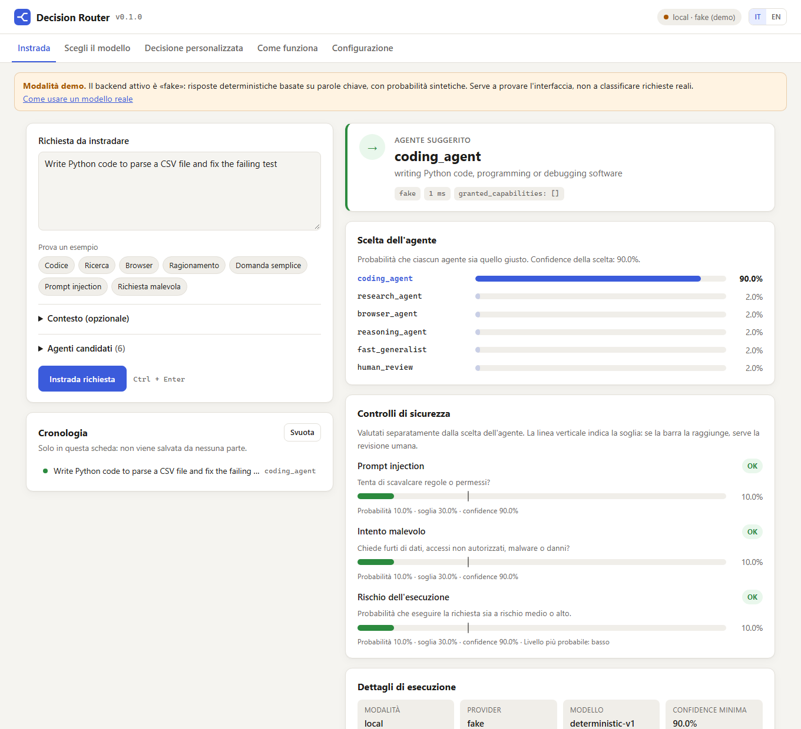
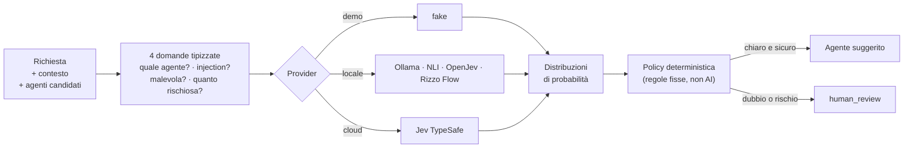
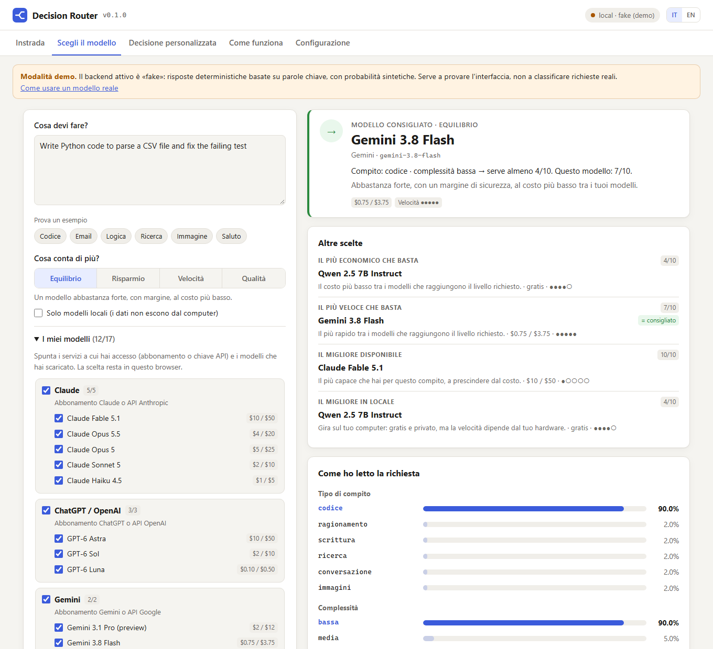

# Decision Router

[Italiano](README.md) · [English](README.en.md)

[](https://github.com/zalaso/decision-router/actions/workflows/test.yml)


**Decide a quale agente o modello AI affidare una richiesta, e se è sicuro farlo.**

Hai più agenti (uno scrive codice, uno fa ricerca, uno usa il browser…) e
magari più abbonamenti o modelli (Claude, ChatGPT, Gemini, modelli locali con
Ollama). Per ogni richiesta il Decision Router suggerisce **l'agente** o **il
modello** più adatto tra quelli che hai e, in parallelo, controlla prompt
injection, intento malevolo e livello di rischio. Se qualcosa non è chiaro, non
tira a indovinare: chiede la **revisione umana**.

Il router **suggerisce e basta**: non esegue agenti, non tocca file e non
concede permessi.

<picture>
  <source media="(prefers-color-scheme: dark)" srcset="docs/img/dashboard-dark.png">
  
</picture>

## Indice

- [Avvio rapido](#avvio-rapido)
- [Come funziona](#come-funziona)
- [La dashboard](#la-dashboard)
- [Scegliere il modello](#scegliere-il-modello)
- [Usarlo dal codice: HTTP, CLI, Python](#usarlo-dal-codice)
- [Usare un modello reale](#usare-un-modello-reale)
- [Configurazione](#configurazione)
- [Sicurezza e limiti](#sicurezza-e-limiti)
- [Sviluppo](#sviluppo)

## Avvio rapido

Serve **Python 3.12 o più recente** ([download](https://www.python.org/downloads/)).
Al primo avvio parte in **modalità demo**: nessun modello da scaricare, nessun
account cloud, nessun dato che esce dal computer.

### Opzione A: doppio clic (consigliata per provarlo)

1. Su GitHub premi **Code → Download ZIP** ed estrai la cartella
   (oppure `git clone https://github.com/zalaso/decision-router.git`).
2. Avvia:
   - **Windows**: doppio clic su `start.bat`
   - **macOS / Linux**: `./start.sh` da terminale

Al primo avvio lo script crea l'ambiente `.venv` e installa le dipendenze
(circa un minuto), poi apre la dashboard su <http://127.0.0.1:8000/dashboard/>.
Gli avvii successivi sono immediati. Per fermarlo: `Ctrl+C` nella finestra
del terminale.

### Opzione B: installazione come comando, direttamente da GitHub

Con [pipx](https://pipx.pypa.io/) o [uv](https://docs.astral.sh/uv/), senza
scaricare il codice a mano:

```bash
pipx install git+https://github.com/zalaso/decision-router.git
```

```bash
decision-router serve --open
```

Con uv: `uv tool install git+https://github.com/zalaso/decision-router.git`.
Per aggiornare: `pipx upgrade decision-router` (oppure `uv tool upgrade decision-router`).

### Opzione C: per sviluppare

```powershell
git clone https://github.com/zalaso/decision-router.git
cd decision-router
py -3.12 -m venv .venv
.venv\Scripts\python -m pip install -e ".[dev]"
.venv\Scripts\decision-router serve --open
```

Su Linux/macOS usare `python3.12 -m venv .venv` e `.venv/bin/` al posto di
`.venv\Scripts\`. È incluso `uv.lock`: `uv sync --locked --extra dev` installa
le versioni fissate.

## Come funziona



1. **Richiesta.** Arriva un testo, con un eventuale contesto e l'elenco degli
   agenti tra cui scegliere (ognuno con una descrizione in linguaggio naturale).
2. **Domande tipizzate.** Il router trasforma la richiesta in quattro domande:
   una *scelta* (quale agente?), due *sì/no* (è prompt injection? è malevola?)
   e un *punteggio* (rischio basso, medio o alto).
3. **Provider.** Un classificatore risponde con una distribuzione di probabilità
   per ogni domanda. Il provider è intercambiabile: demo, modello locale o cloud.
4. **Policy deterministica.** Regole fisse, non AI, decidono l'esito. Se la
   confidence è bassa, se un controllo di sicurezza supera la soglia o se una
   risposta manca, l'esito è `human_review`. Un errore o un timeout non vengono
   mai interpretati come "sicuro".

Le risposte contengono sempre `granted_capabilities: []`: una predizione non
diventa mai un permesso. Chi integra il router decide cosa eseguire.

### Modalità

| Modalità | Cosa fa |
|---|---|
| `local` (default) | Usa solo il backend locale. Nessun dato lascia il computer. |
| `cloud` | Usa solo l'API cloud Jev di TypeSafe (serve `TYPESAFE_API_KEY`). |
| `auto` | Prova in locale. Confidence tra 0,55 e 0,80, errore o timeout: passa al cloud. Sotto 0,55: revisione umana. |
| `shadow` | Interroga locale e cloud in parallelo: usa il primario, registra se il secondario è d'accordo. Serve a confrontare i modelli. |

### Backend locali

| Backend | Descrizione | Peso |
|---|---|---|
| `fake` (default) | Demo deterministica per parole chiave. **Non è un classificatore**: probabilità sintetiche. | nessuno |
| `nli` | mDeBERTa NLI multilingue, CPU, offline. Variante piccola inglese in `config/local-small.yaml`. | ~558 MB / ~26 MB |
| `openjev` | Adapter opzionale GPT-AGI/OpenJev con Qwen2.5-0.5B-Instruct. | ~1 GB |
| `rizzo_flow` | Servizio locale [Rizzo Flow](https://github.com/Rizzo-AI-Academy/rizzo-flow), formato HTTP compatibile Jev. | gestito da Rizzo |
| `ollama` | Un tuo LLM locale con [Ollama](https://ollama.com) (per esempio Qwen 2.5) come classificatore, con probabilità prese dai token. **Consigliato per la scelta del modello.** | ~2 GB (3B) |

## La dashboard

Si apre con `decision-router serve --open` (o con gli script di avvio) su
<http://127.0.0.1:8000/dashboard/>. È servita dalla stessa API, senza build,
senza CDN e senza dipendenze aggiuntive: funziona anche offline.

- **Scegli il modello**: il modello consigliato tra quelli che hai, più le
  alternative (vedi [sotto](#scegliere-il-modello)).
- **Instrada**: scrivi una richiesta (o prova gli esempi, compresi un prompt
  injection e una richiesta malevola) e vedi l'agente suggerito, le probabilità
  per ciascun agente e i tre controlli di sicurezza rispetto alle soglie.
  Gli agenti candidati si modificano direttamente nella pagina.
- **Decisione personalizzata**: componi domande tue (scelta, sì/no, punteggio)
  su un testo e ottieni le distribuzioni di probabilità, senza la policy del router.
- **Come funziona**: la spiegazione del flusso, delle modalità e dei backend.
- **Configurazione**: modalità, backend e soglie con cui è stato avviato il server.
  Le chiavi non vengono mai mostrate, solo se sono presenti. La configurazione
  non si modifica dal browser, di proposito.

Ogni risultato ha i pulsanti **Copia JSON**, **Copia come curl** e **Copia come
PowerShell**, per passare subito dalla prova all'integrazione. La cronologia
resta solo nella scheda del browser. Interfaccia in italiano e inglese, tema
chiaro e scuro automatico.

Un link come `http://127.0.0.1:8000/dashboard/?prompt=Write%20Python%20code`
apre la dashboard e instrada subito quella richiesta.

Con `#models` in fondo al link (`...?prompt=...#models`) la richiesta va invece
alla scheda "Scegli il modello".

Per esporre solo l'API senza interfaccia: `ROUTER_DASHBOARD=false`.

## Scegliere il modello

<picture>
  <source media="(prefers-color-scheme: dark)" srcset="docs/img/models-dark.png">
  
</picture>

Scrivi cosa devi fare e il router ti dice **quale modello usare tra quelli che
hai**: un modello consigliato e, sotto, le alternative.

> **Serve un classificatore vero.** Con il backend demo (`fake`) il risultato è
> solo illustrativo: cerca parole chiave in inglese e stima sempre complessità
> bassa, per cui a "costruisci un gioco simile a Call of Duty" consiglierebbe un
> modello economico. Per consigli reali, anche in italiano, avvia con un LLM
> locale: `start.bat --config config\ollama.yaml` (vedi
> [Un tuo LLM con Ollama](#un-tuo-llm-con-ollama)).

| Scelta | Come viene decisa |
|---|---|
| **Consigliato** | Secondo la tua priorità: *Equilibrio* (default), *Risparmio*, *Velocità* o *Qualità* |
| Il più economico che basta | Il costo più basso tra i modelli che raggiungono il livello richiesto |
| Il più veloce che basta | Il più rapido tra i modelli che raggiungono il livello richiesto |
| Il migliore disponibile | Il più capace che hai per quel compito, a prescindere dal costo |
| Il migliore in locale | Il migliore tra i modelli Ollama: gratis e privato |

*Equilibrio* sceglie il modello più economico che supera il livello richiesto
con un margine di sicurezza.

**Come funziona.** Il classificatore non indovina il modello: capisce solo che
tipo di compito è (codice, ragionamento, scrittura, ricerca, conversazione,
immagini) e quanto è complesso (bassa, media, alta). Poi regole fisse
confrontano queste risposte con un catalogo di modelli e scelgono tra quelli che
hai selezionato:

- ogni modello ha un punteggio da 0 a 10 per tipo di compito, un costo relativo
  e una velocità;
- la complessità fissa il livello minimo: 4/10, 6/10 o 8/10;
- se la richiesta è ambigua tra due compiti, il modello deve essere bravo in
  entrambi; se la complessità è incerta, la considera un livello più alta.
  Nel dubbio sale verso un modello più capace, invece di bloccarsi;
- prompt injection e intento malevolo bloccano il consiglio (revisione umana).
  Il rischio di esecuzione qui è solo informativo, perché scegliere un modello
  non esegue nulla.

**I tuoi modelli.** Nella dashboard, sotto "I miei modelli", spunti i servizi a
cui hai accesso (abbonamento Claude, ChatGPT, Gemini o le relative API) e i
modelli locali. La scelta resta nel browser. Se [Ollama](https://ollama.com) è
attivo, i modelli scaricati vengono **rilevati da soli**. Anche quelli che non
sono nel catalogo compaiono, con un profilo stimato in base alla dimensione.

**Il catalogo** è in [`src/decision_router/catalog.yaml`](src/decision_router/catalog.yaml).
Contiene Claude (Fable 5.1, Opus 5.5, Opus 5, Sonnet 5, Haiku 4.5), OpenAI
(GPT-6 Astra, Sol, Luna), Google (Gemini 3.1 Pro, 3.8 Flash) e modelli locali
(Qwen, DeepSeek R1). Nomi, prezzi API, contesto e dimensioni vengono dalle
pagine ufficiali (verificati il 23 settembre 2026). I **punteggi per compito sono
stime**: copia il file, modificalo e indicalo con `ROUTER_MODEL_CATALOG` per
usare i tuoi.

Dalla riga di comando:

```bash
decision-router recommend "Write a Python script that reads a CSV file"
decision-router recommend "Summarize this contract" --models claude-sonnet-5,qwen2-5-7b --priority economy
decision-router recommend "Translate this email" --local-only
```

Via HTTP: `POST /v1/models/recommend` con `prompt`, `available` (gli ID del
catalogo che puoi usare), `priority` e `local_only`. Il router **consiglia e
basta**: per chiamare davvero il modello scelto usa il suo `api_model` con il
tuo client o con un gateway multi-modello.

## Usarlo dal codice

### HTTP

`decision-router serve` avvia l'API su `127.0.0.1:8000`. La documentazione
interattiva OpenAPI è su <http://127.0.0.1:8000/docs>.

| Endpoint | Uso |
|---|---|
| `POST /v1/route` | Instrada una richiesta: agente suggerito + controlli di sicurezza + policy. |
| `POST /v1/models/recommend` | Consiglia il modello da usare tra quelli disponibili, con alternative. |
| `GET /v1/models` | Catalogo dei modelli e modelli Ollama rilevati (`?rescan=true` per aggiornare). |
| `POST /v1/decisions` | Decisione generica con domande tue (contratto in `examples/decision.json`). |
| `GET /v1/status` | Configurazione attiva, senza segreti. |
| `GET /health` | Stato del servizio. |

```bash
curl -s http://127.0.0.1:8000/v1/route -H "Content-Type: application/json" -d '{"prompt":"Write Python code"}'
```

```powershell
Invoke-RestMethod http://127.0.0.1:8000/v1/route -Method Post -ContentType application/json -Body '{"prompt":"Write Python code"}'
```

Risposta (ridotta):

```json
{
  "policy": {
    "agent": "coding_agent",
    "review_required": false,
    "reasons": [],
    "granted_capabilities": []
  },
  "evaluation": {
    "status": "decided",
    "decision": {"provider": "fake", "answers": {"route": {"selected": "coding_agent", "confidence": 0.9}}}
  }
}
```

Gli agenti si personalizzano con il campo `candidates`
(`[{"id": "...", "description": "..."}]`); `human_review` deve restare tra i
candidati come uscita sicura.

### Riga di comando

```bash
decision-router route "Write Python code"
decision-router recommend "Write Python code" --priority quality
decision-router decide examples/decision.json
decision-router serve --port 9000 --config config/example.yaml
```

Exit code: `0` decisione presa (o modello consigliato), `2` revisione umana o
nessun modello da consigliare, `1` errore di avvio o input.
Comodo negli script: `decision-router route "..." || echo "serve una persona"`.

### Libreria Python

```python
import asyncio
import logging
from decision_router import Choice, Candidate, DecisionRequest, DecisionEngine
from decision_router.audit import JsonAudit
from decision_router.config import Settings
from decision_router.providers.fake import FakeProvider

engine = DecisionEngine(settings=Settings(), local=FakeProvider(), cloud=None,
                        audit=JsonAudit(logging.getLogger("decision_router.audit")))

async def main():
    result = await engine.decide(DecisionRequest(prompt="write code", questions=[
        Choice(id="route", instructions="Choose agent", candidates=[
            Candidate(id="coder", description="write code"),
            Candidate(id="human", description="manual review"),
        ])
    ]))
    print(result.model_dump_json(indent=2))

asyncio.run(main())
```

## Usare un modello reale

### Modello NLI locale (offline, gratuito)

```powershell
.venv\Scripts\python -m pip install -e ".[local]"
$env:HF_HOME = "$PWD\.models"
# Download esplicito dei pesi pubblici, senza codice remoto:
.venv\Scripts\python scripts/download_model.py --config config/local.yaml
# Da qui in poi completamente offline:
$env:HF_HUB_OFFLINE = "1"
.venv\Scripts\decision-router --config config/local.yaml serve --open
```

Il modello primario è mDeBERTa NLI multilingue (circa 558 MB, CPU float32).
L'alternativa piccola inglese è `config/local-small.yaml` (circa 26 MB):
molto più veloce, meno accurata. Revisioni bloccate, `trust_remote_code=False`,
solo safetensors. Il modello gira in un processo figlio che viene terminato su
timeout. In locale conta la **descrizione** di candidati e livelli: il
classificatore NLI non legge le `instructions`. Confronto e limiti in
[LOCAL_MODELS](docs/LOCAL_MODELS.md).

### OpenJev locale (opzionale)

Adapter per **GPT-AGI/OpenJev** con il checkpoint pubblico Qwen2.5-0.5B-Instruct,
selezionabile con `config/openjev.yaml`. Non è il default e non è una replica
di TypeSafe Jev. Installazione alla revisione fissata e limiti in
[OPENJEV](docs/OPENJEV.md).

### Un tuo LLM con Ollama

Il modo consigliato per la scelta del modello: un LLM che gira sul tuo computer
fa da classificatore. Capisce l'italiano, distingue una chiacchierata da un
progetto complesso ed è gratuito e offline.

```powershell
ollama pull qwen2.5:3b-instruct
.venv\Scripts\decision-router --config config/ollama.yaml serve --open
```

Con gli script di avvio: `start.bat --config config\ollama.yaml` (oppure
`./start.sh --config config/ollama.yaml`). Il router pone al modello una domanda
alla volta (tipo di compito, complessità, injection, intento malevolo) e legge
le probabilità delle risposte dai token generati: sono uscite reali del modello,
non probabilità calibrate. Serve una versione di Ollama che restituisca i
`logprobs` (le versioni recenti lo fanno).

**Quanto è lento.** Su un portatile senza GPU (Ryzen 3 2200U, 8 GB di RAM) Qwen
2.5 3B impiega circa 30-40 secondi per richiesta, di più al primo avvio perché
carica il modello. La stessa richiesta con un'altra priorità o altri modelli
selezionati è immediata, perché la classificazione viene riusata. Con 16 GB di
RAM o una GPU puoi usare un modello più grande, più preciso sulla complessità:
`ROUTER_OLLAMA_MODEL=qwen2.5:7b-instruct` (o modifica `config/ollama.yaml`).

### Rizzo Flow locale (opzionale)

Avviare [Rizzo Flow](https://github.com/Rizzo-AI-Academy/rizzo-flow) in un
terminale separato (`uv sync --locked`, `uv run rizzo download`,
`uv run rizzo serve`), poi:

```powershell
.venv\Scripts\decision-router --config config/rizzo-flow.yaml serve --open
```

L'indirizzo deve essere un'origine HTTP di loopback numerica
(`ROUTER_RIZZO_BASE_URL`, default `http://127.0.0.1:8017`); l'eventuale
`RIZZO_API_KEY` si legge solo dall'ambiente. Dettagli in [RIZZO_FLOW](docs/RIZZO_FLOW.md).

### Cloud Jev (TypeSafe)

```powershell
$env:TYPESAFE_API_KEY = "..."   # solo nell'ambiente, mai nei file YAML
$env:ROUTER_MODE = "auto"
$env:ROUTER_LOCAL_BACKEND = "nli"
.venv\Scripts\decision-router serve --open
```

`auto` e `shadow` possono inviare prompt e contesto al cloud: per dati che non
devono uscire dal computer usare `local`. L'uso del cloud può comportare
addebiti. `python scripts/check_shadow.py` esegue un confronto live limitato
(3 esempi sintetici, massimo 10); senza chiave stampa `not_run`.

## Configurazione

Precedenza: valori di default < file YAML (`--config` o `ROUTER_CONFIG`) <
variabili d'ambiente `ROUTER_*`. `.env.example` elenca tutte le variabili ma
non viene caricato automaticamente.

| Variabile | Default | Significato |
|---|---|---|
| `ROUTER_MODE` | `local` | `local`, `cloud`, `auto`, `shadow` |
| `ROUTER_LOCAL_BACKEND` | `fake` | `fake`, `nli`, `openjev`, `rizzo_flow`, `ollama` |
| `ROUTER_TIMEOUT_S` | `5` | Timeout per singolo tentativo |
| `ROUTER_LOCAL_ACCEPT_CONFIDENCE` | `0.80` | Sopra: il risultato locale è accettato |
| `ROUTER_REVIEW_BELOW_CONFIDENCE` | `0.55` | Sotto: revisione umana |
| `ROUTER_SAFETY_MIN_CONFIDENCE` | `0.80` | Confidence minima dei controlli di sicurezza |
| `ROUTER_INJECTION_THRESHOLD` / `_MALICIOUS_` / `_RISK_` | `0.30` | Soglie dei tre controlli |
| `ROUTER_DASHBOARD` | `true` | Serve la dashboard su `/dashboard/` |
| `ROUTER_MODEL_CATALOG` | vuoto | Percorso di un catalogo modelli YAML personalizzato |
| `ROUTER_OLLAMA_DETECT` | `true` | Rileva i modelli scaricati con Ollama |
| `ROUTER_OLLAMA_BASE_URL` | `http://127.0.0.1:11434` | Indirizzo di Ollama (solo loopback) |
| `ROUTER_OLLAMA_MODEL` | `qwen2.5:3b-instruct` | LLM usato dal backend `ollama` |
| `ROUTER_API_TOKEN` | vuoto | Se impostato, richiede `Authorization: Bearer <token>` |
| `TYPESAFE_API_KEY` | vuoto | Chiave per il cloud Jev |

Le soglie sono **esempi non calibrati**: la confidence Jev e la probabilità
massima NLI hanno significati diversi. Prima dell'uso reale vanno calibrate per
modello, compito e numero di candidati: procedura in [CALIBRATION](docs/CALIBRATION.md).

## Sicurezza e limiti

- **Routing e autorizzazione restano separati.** Il router non esegue nulla e
  non concede permessi, nemmeno se il prompt lo chiede.
- **Fail-closed.** Evidenze mancanti, malformate o incerte portano a revisione
  umana; un modello non disponibile non equivale mai a "sicuro".
- **Il backend `fake` non classifica nulla**: serve solo a provare interfaccia e API.
- **I classificatori non rilevano tutti gli attacchi.** Le autorizzazioni del
  sistema che usa il router devono reggere anche se la classificazione sbaglia.
- **Solo loopback per default.** `decision-router serve` rifiuta di ascoltare
  su un indirizzo non locale se `ROUTER_API_TOKEN` non è impostato. Per esporlo
  in rete servono anche un proxy TLS fidato e quote condivise tra processi
  (`ROUTER_REQUIRE_HTTPS=true` dietro il proxy).
- **Log sanificati**: niente prompt, contesto, chiavi o URL nei log di audit.

Nella misura CPU inclusa, mDeBERTa individua il candidato atteso in 15 casi su
16 ma impiega circa 4,5 secondi per richiesta e, con le soglie attuali, manda
**tutti** i casi in revisione; il modello piccolo impiega circa 195 ms e ne
individua 12 su 16. Il prototipo funziona; il routing autonomo richiede ancora
calibrazione. Dettagli in [ARCHITECTURE](docs/ARCHITECTURE.md),
[SECURITY](docs/SECURITY.md) e [VERIFICATION](docs/VERIFICATION.md).

## Sviluppo

```powershell
.venv\Scripts\python -m pytest -q
.venv\Scripts\python -m mypy
.venv\Scripts\python -m ruff check .
.venv\Scripts\python benchmarks/run.py --config config/example.yaml
```

Con i modelli scaricati:

```powershell
.venv\Scripts\python scripts/download_model.py --config config/local-small.yaml
.venv\Scripts\python benchmarks/run.py --config config/local.yaml --compare-config config/local-small.yaml
$env:RUN_LOCAL_MODEL_TESTS = "1"
.venv\Scripts\python -m pytest tests/test_model_integration.py -q
```

Il benchmark riporta accuratezza, accordo tra provider, latenza, Brier ed ECE;
il campione incluso è uno smoke test sintetico, non una validazione scientifica.
`benchmarks/run.py --export-labeled` esporta distribuzioni etichettate e
`benchmarks/calibrate.py` misura temperatura e metriche su un test separato.

La dashboard è in `src/decision_router/static/` (HTML, CSS e JavaScript senza
dipendenze) ed è servita da `src/decision_router/dashboard.py`.

## Licenza

MIT per il codice originale; modelli e dipendenze mantengono le proprie licenze.
