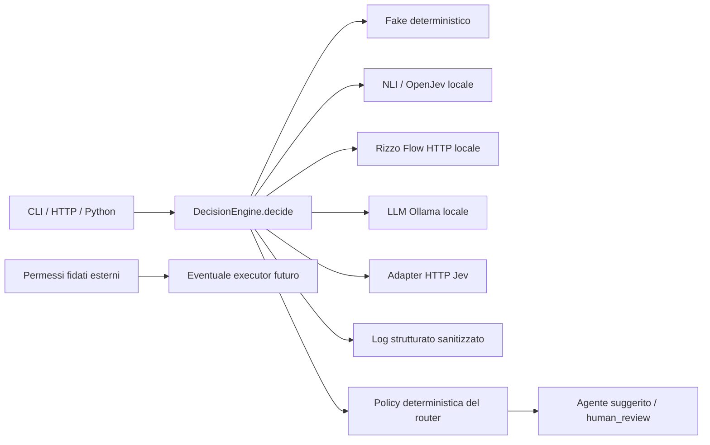

# Architettura

L'interfaccia pubblica per decidere è `await DecisionEngine.decide(DecisionRequest)`.
`DecisionProvider` ha lo stesso metodo e permette di sostituire Jev Cloud,
NLI locale, GPT-AGI/OpenJev locale, Rizzo Flow locale, un LLM Ollama locale e fake.
Il composition root `runtime.py` costruisce le dipendenze; gli adapter e
l'orchestratore le ricevono. Il dominio non importa SDK TypeSafe né Transformers.

## Contratto e invarianti

- Choice: almeno due candidati con ID univoci; nessun training dipende dagli ID.
- Boolean: distribuzione `false/true`. Noul è tradotto solo nell'adapter Jev.
- Score: livelli ordinati, probabilità indicizzate da `0`, valore atteso dell'indice.
- Ogni risposta copre esattamente tutte le domande e tutti i candidati; nessun
  valore non finito, distribuzione incompleta o somma diversa da uno è accettato.
- `selected` è sempre un argmax. Le parità vengono mantenute senza inventare
  significatività statistica. `confidence_source` rende esplicita la provenienza.
- In fallimento non si inventa una distribuzione per `human_review`: la decisione
  può essere assente; `status`, tentativi e policy indicano l'astensione.

Il contratto HTTP Jev è verificato su [API ufficiale](https://docs.typesafe.ai/api)
e [schema SDK ufficiale](https://github.com/typesafe-ai/typesafe-sdk-python/blob/main/src/typesafe_sdk/_schemas/models.py).
Choice/Score mantengono la confidence del provider. Boolean usa `max(p, 1-p)`
e la indica come derivata. Jev documenta confidence come statistica della
distribuzione, senza una formula universale da replicare:
[confidence ufficiale](https://docs.typesafe.ai/confidence).
Nessuna chiamata live Jev è necessaria ai test contrattuali.

## Modalità e budget

`local` e `cloud` interrogano soltanto il rispettivo slot. Il backend fake può
occupare lo slot locale per sviluppo, sempre identificato come `fake`.
`auto` considera il minimo delle confidence delle domande: >= soglia alta
accetta il locale, fascia intermedia interroga il cloud, sotto soglia bassa
si astiene. Errore locale, timeout o input non supportato passa al cloud.
Errore cloud si astiene, senza riciclare un risultato locale incerto.
La policy conserva inoltre le evidenze positive di rischio dei tentativi
precedenti: un fallback cloud non può cancellare un rischio già segnalato.
Questo controllo non usa il provider secondario in shadow.

`shadow` esegue i due slot in parallelo, mantiene solo quello configurato come
primario e registra confronto per domanda. Anche quando il primario fallisce,
il secondario non viene promosso. Il risultato include entrambi i tentativi,
distribuzioni, confidence, latenza ed eventuali errori. Per Score l'agreement
confronta il livello più probabile, non l'uguaglianza dei valori attesi.

Timeout per tentativo esplicito: `auto` può impiegare due timeout, `shadow`
circa uno più overhead. Nessun retry automatico moltiplica i costi. Cold start
del modello precede le richieste e viene misurato separatamente.
NLI e OpenJev locali usano un processo figlio con un solo task alla volta e IPC
limitato. Su timeout o cancellazione il padre termina il processo, anche se
Torch è bloccato nel kernel; il provider poi resta indisponibile e non accoda
richieste. Lo scorer diretto usato nei test di contratto mantiene un thread,
ma non è il composition root di CLI e API. Startup e inferenza hanno timeout
distinti. Il processo non fornisce isolamento di sicurezza da codice ostile.
OpenJev è un'integrazione opzionale della libreria upstream, con installazione
e peso separati: vedere `OPENJEV.md`.
Rizzo Flow è un servizio HTTP locale separato, con contratto compatibile Jev:
vedere `RIZZO_FLOW.md`. Il timeout del router non termina il processo Rizzo.

## Scelte di ambito

Python >=3.12, FastAPI, Pydantic v2, httpx, PyYAML, pytest. Torch/Transformers
sono optional e isolati. Nessun database, esecuzione downstream o rete
distribuita. La dashboard web (`dashboard.py` e `static/`) è un client dello
stesso contratto HTTP: HTML, CSS e JavaScript statici, senza build né CDN,
serviti dall'app FastAPI su `/dashboard/`. Legge `GET /v1/status` (fatti non
segreti) e chiama `/v1/route` e `/v1/decisions` come qualunque altro client;
non ha stato lato server e non modifica la configurazione.

La raccomandazione del modello (`recommend.py`, `catalog.py`) riusa lo stesso
motore con domande proprie: una Choice sul tipo di compito, uno Score sulla
complessità e le domande di sicurezza. Il classificatore non vede il catalogo.
`rank()` è una funzione pura: dal compito, dal livello richiesto e dai modelli
disponibili ricava il consigliato secondo la priorità e le alternative
(economico, veloce, migliore, locale), con spareggi fissi per costo, velocità e
ID. L'incertezza su compito o complessità alza il livello richiesto invece di
bloccare. Bloccano solo injection, intento malevolo o evidenze mancanti su di
essi (`DeterministicPolicy.safety_reasons(include_risk=False)`). Il catalogo è
YAML validato all'avvio; `CatalogService` aggiunge i modelli rilevati da Ollama. MIT per il codice originale. OmniRoute risolve il gateway per
modelli downstream, ma non sostituisce la distribuzione decisionale tipizzata
né la policy di questo slice: non viene aggiunto senza necessità.

Il JSON espone predizioni; la libreria `routing.route` le combina con la policy.
`/v1/decisions` è generico e non costituisce autorizzazione né attestazione di
sicurezza. `/v1/route` costruisce autonomamente le domande di rischio, così il
chiamante non può rimuoverle. `human_review` è un candidato obbligatorio solo
per il router dimostrativo, non per il contratto decisionale generico.
